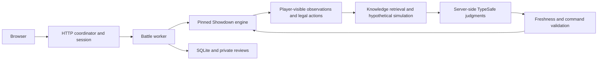

# Architecture and customization

`npm start` runs `src/public/main.ts`. One HTTP coordinator owns the SQLite ledger and starts an isolated worker for each active battle. The browser receives its own player stream and can review its completed decisions using its guest session.

The engine owns rules, legality, mechanics, damage and execution. Jev supplies strategic judgments over permitted observations and retrieved context. Unknown opponent sets remain hypotheses. The current pipeline includes the top-four simulation brief, team brief and battle memory. Independent calls overlap; operations that depend on prior results remain ordered.

| Change | Start here |
| --- | --- |
| Port, concurrency and usage limits | `.env.example`, `src/public/main.ts` |
| Model and context limits | `lab.config.json`, `src/schema.ts`, `src/jev.ts` |
| Strategic questions and memory | `src/live-sim/`, `src/live-top4/`, `src/team-context/` |
| Authorized observations and legal candidates | `src/showdown/log-only.ts`, `src/showdown/actions.ts` |
| Team catalog | `teams/tournament-catalog.json`, `src/showdown/catalog.ts` |
| Lobby and battle UI | `src/showdown/launcher.html`, `demo.js`, `demo.css`, `src/public/public.css` |
| Persistence and HTTP endpoints | `src/public/store.ts`, `src/public/server.ts` |

Run `npm run verify-data` after editing team or knowledge data. Tournament teams are checked against their public source and individually documented stat-point allocations. A missing or altered source disables the affected team. The knowledge loader pins reviewed content hashes; editing generated cards alone will intentionally fail verification. Keep the human pages, card bundle, entity data, relationships and reviewed rules consistent before updating a hash. Changing the engine revision also requires reviewing format compatibility.

The `scenarioPath` and `outputPath` fields in `lab.config.json` are retained by the shared configuration schema; the arena does not load those legacy CLI paths. Private runtime output goes to `ARENA_DATA_DIR`.

The source fingerprint includes TypeScript files. This smaller distribution has its own fingerprint even when its decision behavior matches the hosted source. Each installation maintains its own scoreboard and history.

Consult the [current TypeSafe SDK documentation](https://docs.typesafe.ai/sdk/javascript) before changing API calls. Keep credentials server-side and preserve the quota permit, stale-observation and hidden-information boundaries.
